# 🔧 AIFixer

**Fix your code with AI, right from your terminal**
<p align="center">
  
  <br><br>
  <a href="https://github.com/bradflaugher/aifixer/actions"></a>
  <a href="https://github.com/bradflaugher/aifixer/stargazers"></a>
  <a href="https://github.com/bradflaugher/aifixer/network/members"></a>
  <a href="https://github.com/bradflaugher/aifixer/issues"></a>
  <a href="https://github.com/bradflaugher/aifixer/blob/main/LICENSE"></a>
</p>

<p align="center">
  <strong>Simple • Portable • Powerful</strong>
  <br>
  <em>The Unix way to use AI for code: pipe in, get better code out</em>
</p>

---

## ✨ What is AIFixer?

AIFixer is a lightweight command-line tool that uses AI to fix, improve, and complete your code. It follows the Unix philosophy: do one thing well, work with pipes, stay simple.

```sh
# It's this simple:
cat broken.py | aifixer > fixed.py
```

### 🎯 Why AIFixer?

- **🪶 Lightweight**: Just a shell script - no Node.js, Python, or heavy dependencies
- **🔌 Flexible**: Use any AI model - OpenRouter gives you access to Claude, GPT-4, Gemini, and more
- **🏠 Privacy-first**: Run completely offline with Ollama and local models
- **💰 Pay-per-use**: No subscriptions - only pay for what you use
- **🐧 Universal**: Works on Linux, macOS, BSD, WSL - anywhere with a shell

## 🚀 Quick Start

### 1. Install (30 seconds)

```sh
curl -sL https://raw.githubusercontent.com/bradflaugher/aifixer/main/install.sh | sh
```

The installer will:
- ✅ Install jq if needed (our only dependency)
- ✅ Add aifixer to your PATH
- ✅ Help you set up your API key

### 2. Get an API Key

Sign up for a free [OpenRouter](https://openrouter.ai) account and [create an API key](https://openrouter.ai/keys).

```sh
export OPENROUTER_API_KEY="sk-or-v1-..."
```

### 3. Start Fixing Code!

```sh
# Fix TODO comments in your code
cat app.py | aifixer > app_fixed.py

# Ask for specific improvements
cat script.sh | aifixer -p "add error handling and logging" > robust_script.sh

# Generate new code
aifixer -p "write a Python script to resize images" > resize_images.py
```

## 📚 Real-World Examples

### 🔧 Fix Code with TODOs

<details>
<summary><strong>Input:</strong> <code>server.js</code> with TODO comments</summary>

```javascript
const express = require('express');
const app = express();

// TODO: Add request logging middleware
// TODO: Add error handling for async routes
// TODO: Implement rate limiting

app.get('/api/users/:id', (req, res) => {
    // TODO: Validate user ID format
    // TODO: Add caching
    const user = db.getUser(req.params.id);
    res.json(user);
});

app.listen(3000);
```
</details>

<details>
<summary><strong>Output:</strong> Complete implementation</summary>

```javascript
const express = require('express');
const morgan = require('morgan');
const rateLimit = require('express-rate-limit');
const NodeCache = require('node-cache');
const { body, param, validationResult } = require('express-validator');

const app = express();
const cache = new NodeCache({ stdTTL: 600 }); // 10 minute cache

// Add request logging middleware
app.use(morgan('combined'));

// Implement rate limiting
const limiter = rateLimit({
    windowMs: 15 * 60 * 1000, // 15 minutes
    max: 100 // limit each IP to 100 requests per windowMs
});
app.use('/api/', limiter);

// Add error handling for async routes
const asyncHandler = (fn) => (req, res, next) => {
    Promise.resolve(fn(req, res, next)).catch(next);
};

app.get('/api/users/:id', 
    // Validate user ID format
    param('id').isUUID().withMessage('Invalid user ID format'),
    asyncHandler(async (req, res) => {
        const errors = validationResult(req);
        if (!errors.isEmpty()) {
            return res.status(400).json({ errors: errors.array() });
        }

        const userId = req.params.id;
        
        // Check cache first
        const cachedUser = cache.get(userId);
        if (cachedUser) {
            return res.json(cachedUser);
        }

        const user = await db.getUser(userId);
        
        // Add to cache
        cache.set(userId, user);
        
        res.json(user);
    })
);

// Global error handler
app.use((err, req, res, next) => {
    console.error(err.stack);
    res.status(500).send('Something broke!');
});

app.listen(3000, () => {
    console.log('Server running on port 3000');
});
```
</details>

### 🤖 Other Common Tasks

```sh
# Explain complex code
cat legacy_algorithm.c | aifixer -p "explain what this does in simple terms"

# Add type hints to Python
cat utils.py | aifixer -p "add comprehensive type hints" > typed_utils.py

# Convert between languages
cat script.sh | aifixer -p "convert this to Python" > script.py

# Optimize performance
cat slow_query.sql | aifixer -p "optimize this query" > fast_query.sql

# Add tests
cat calculator.js | aifixer -p "write unit tests for this" > calculator.test.js
```

## 🛠️ Advanced Usage

### Choose Your AI Model

AIFixer supports 100+ models through OpenRouter. Pick the right tool for the job:

```sh
# List all available models
aifixer --list

# Use GPT-4 for complex tasks
cat complex_refactor.py | aifixer -m openai/gpt-4 > refactored.py

# Use Claude for nuanced code review
cat api.rb | aifixer -m anthropic/claude-3.5-sonnet -p "review for security issues"

# Use a fast model for simple fixes
cat style.css | aifixer -m google/gemini-flash-1.5 -p "fix formatting"
```

### Run Offline with Ollama

Perfect for sensitive code or when you're offline:

```sh
# Install Ollama (if not already installed), see https://ollama.com/download/linux
curl -fsSL https://ollama.com/install.sh | sh

# Pull a coding model
ollama pull codellama

# Use it with AIFixer
cat private_code.py | aifixer -o codellama > fixed_private_code.py
```

### Integrate into Your Workflow

```sh
# Git pre-commit hook
git diff --cached --name-only | grep "\.py$" | xargs cat | aifixer -p "check for common bugs"

# CI/CD pipeline
find src -name "*.js" -exec sh -c 'cat {} | aifixer > {}.fixed && mv {}.fixed {}' \;

# Vim integration
:!cat % | aifixer > %.fixed && mv %.fixed %

# VS Code task
"command": "cat ${file} | aifixer > ${file}.fixed && mv ${file}.fixed ${file}"
```

## 🔧 Configuration

### Environment Variables

```sh
# Required for OpenRouter
export OPENROUTER_API_KEY="sk-or-v1-..."

# Optional: Set default model
export AIFIXER_MODEL="anthropic/claude-3.5-sonnet"

# Optional: Custom prompts directory
export AIFIXER_PROMPTS_DIR="$HOME/.config/aifixer/prompts"
```

### Custom Prompts

Save frequently used prompts:

```sh
# Save a custom prompt
echo "Add comprehensive error handling and logging" > ~/.config/aifixer/prompts/robust

# Use it
cat server.py | aifixer -p @robust > robust_server.py
```

## 📖 Command Reference

```
Usage: aifixer [OPTIONS] [TEXT...]

Options:
  -h, --help              Show help
  -v, --version           Show version
  -m, --model MODEL       Use specific model (default: anthropic/claude-3.5-sonnet)
  -o, --ollama MODEL      Use Ollama model (local)
  -p, --prompt TEXT       Custom prompt (default: "Fix the TODOs")
  -l, --list              List available models
  --list-ollama           List local Ollama models

Examples:
  # Fix TODOs in a file
  cat app.py | aifixer > fixed_app.py
  
  # Generate new code
  aifixer -p "write a web scraper in Python" > scraper.py
  
  # Use local model
  cat private.rs | aifixer -o codellama > fixed_private.rs
  
  # Explain code
  cat complex.c | aifixer -p "explain this code" > explanation.md
```

## 📄 License

GPLv3 License - see [LICENSE](LICENSE) for details.

## 🙏 Acknowledgments

- Built on [OpenRouter](https://openrouter.ai) for model access
- Local AI powered by [Ollama](https://ollama.ai)
- Inspired by Unix philosophy

---

## YouTube Ad

<a href="https://www.youtube.com/watch?v=lXaeMkBTvkw">
  
  <br><br>Watch On YouTube
</a>

<p align="center">
  Made with ❤️ by developers who love the command line
  <br>
  <a href="https://github.com/bradflaugher/aifixer">⭐ Star us on GitHub</a>
</p>
